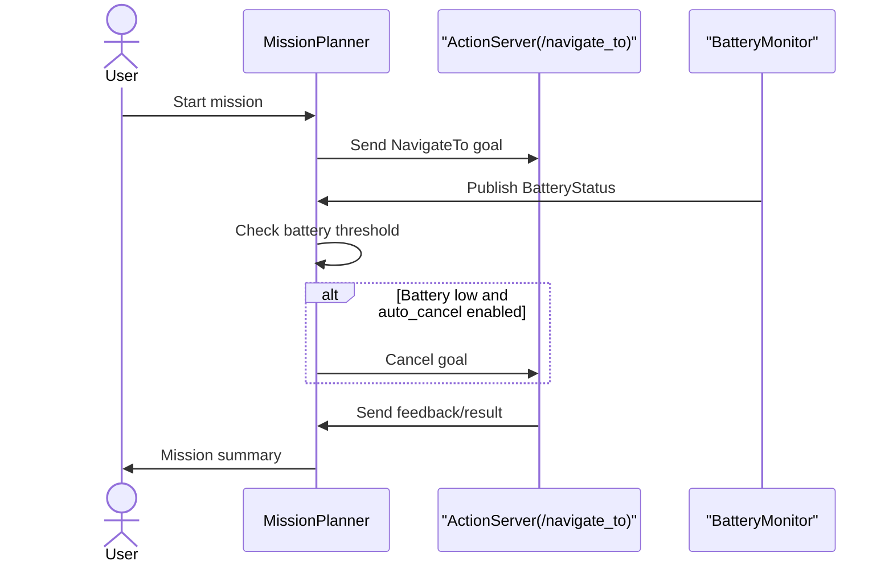
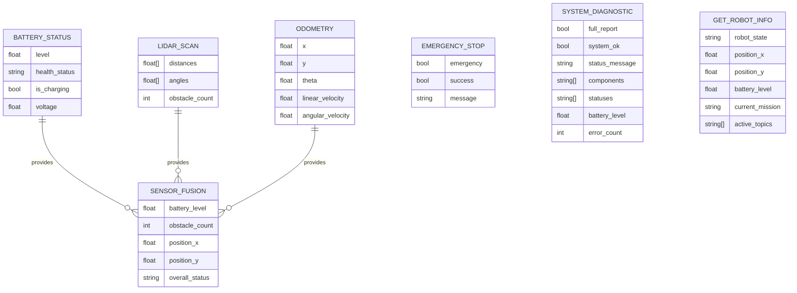
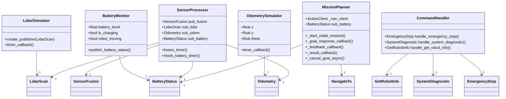

#### Sequence diagram for mission planning and battery-based cancellation

#### ER diagram for new delivery_interfaces and robot_interfaces services/messages

#### Class diagram for new and updated ROS2 nodes

